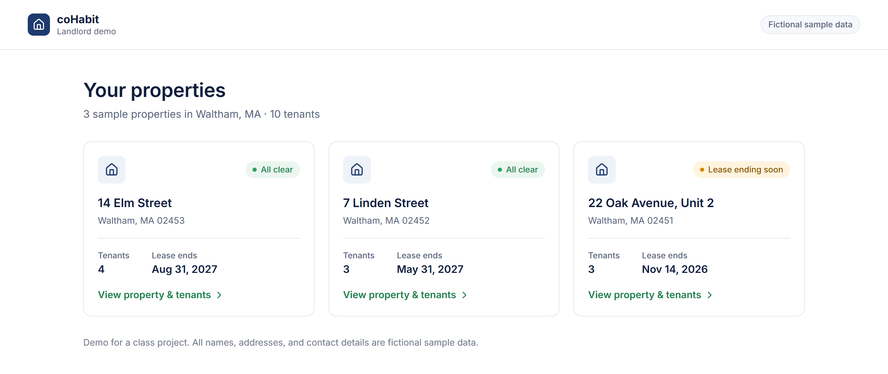
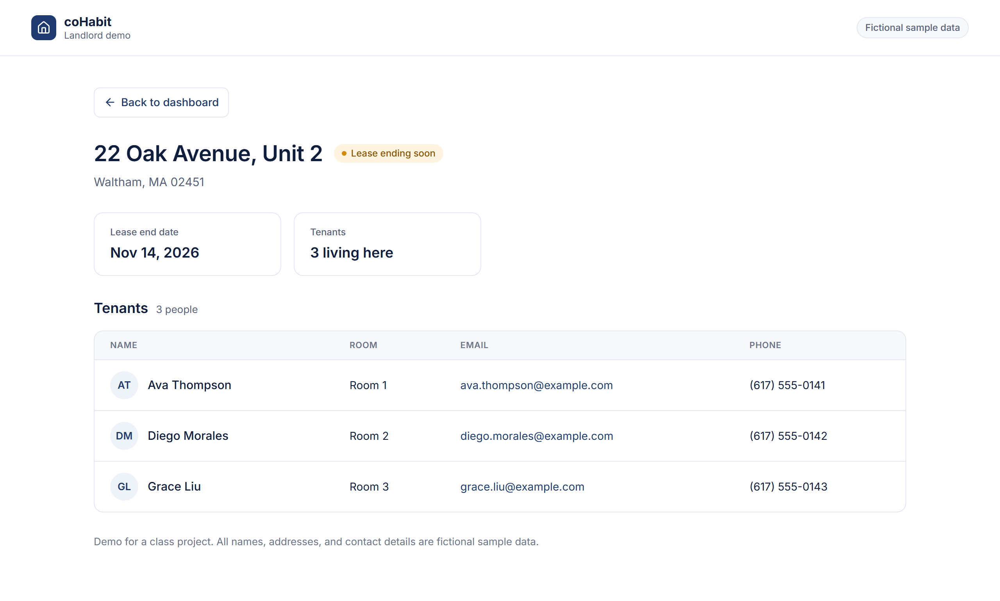

# coHabit — Landlord Demo

### [👉 View the live demo](https://cohabit-landlord-demo.dolgorsureng.workers.dev)

[](https://cohabit-landlord-demo.dolgorsureng.workers.dev)

[](https://cohabit-landlord-demo.dolgorsureng.workers.dev/properties/22-oak-avenue-unit-2)

A two-page demo for a class project. **All names, addresses and contact details are fictional.**

- **Live site:** https://cohabit-landlord-demo.dolgorsureng.workers.dev
- **Design (Figma):** https://www.figma.com/design/QDAewcvq3aSsZgfQvw1v4X

| Page | Address |
| --- | --- |
| Landlord Dashboard | `/` |
| Property and Tenants | `/properties/<id>`, e.g. `/properties/14-elm-street` |

This is separate from the main coHabit app in `Documents\cohabit`. It has no login, no database and no server code. It runs on Cloudflare's free plan as its own site (`cohabit-landlord-demo`).

## Change the sample properties and tenants

1. Open `public/data.js` in any text editor (Notepad or VS Code both work).
2. Edit the text between the quote marks. The notes at the top of the file explain each field:
   - `status` must be exactly `"All clear"` or `"Lease ending soon"`.
   - `id` becomes the page address. Use lowercase letters, numbers and dashes only.
   - The tenant counts are calculated for you.
   - To add a property or tenant, copy an existing `{ ... }` block and keep the commas between blocks.
3. Save the file, then publish (below).

## Preview on your computer (optional)

Open a terminal in this folder and run:

```
npm run dev
```

Then visit http://localhost:8787. Press `Ctrl+C` to stop.

## Publish changes

```
npm run deploy
```

If Cloudflare asks you to log in, a browser window opens. Sign in and click **Allow**. The live site updates within about a minute.

If the page looks broken after an edit, the usual cause is a missing comma or quote mark in `data.js`. Undo the last change and try again.

## Files

```
public/index.html   page frame (top bar, icons)
public/app.js       the two screens and navigation
public/data.js      sample properties and tenants  ← edit this one
public/styles.css   colors, spacing, phone layout (values match Figma)
wrangler.jsonc      Cloudflare settings
```
