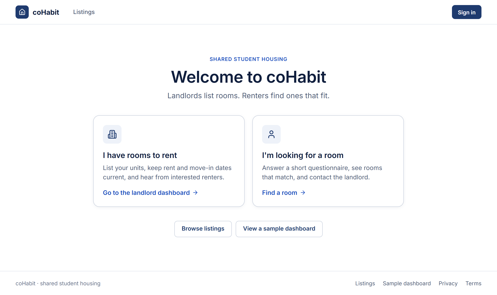
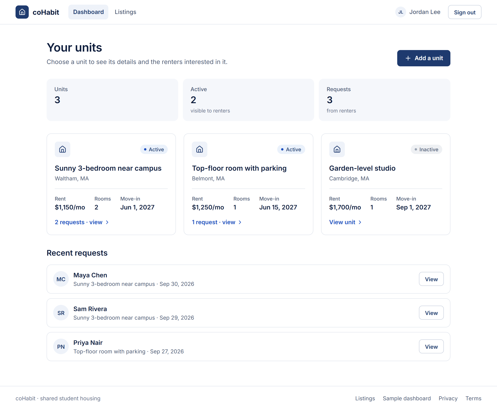
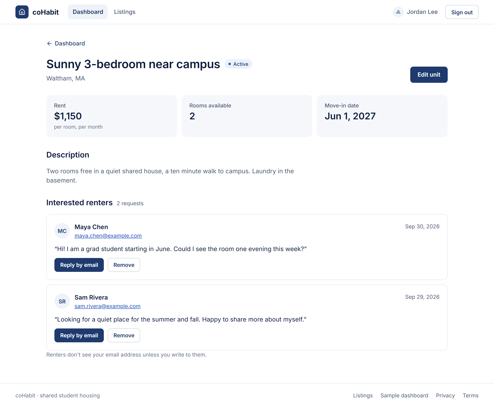
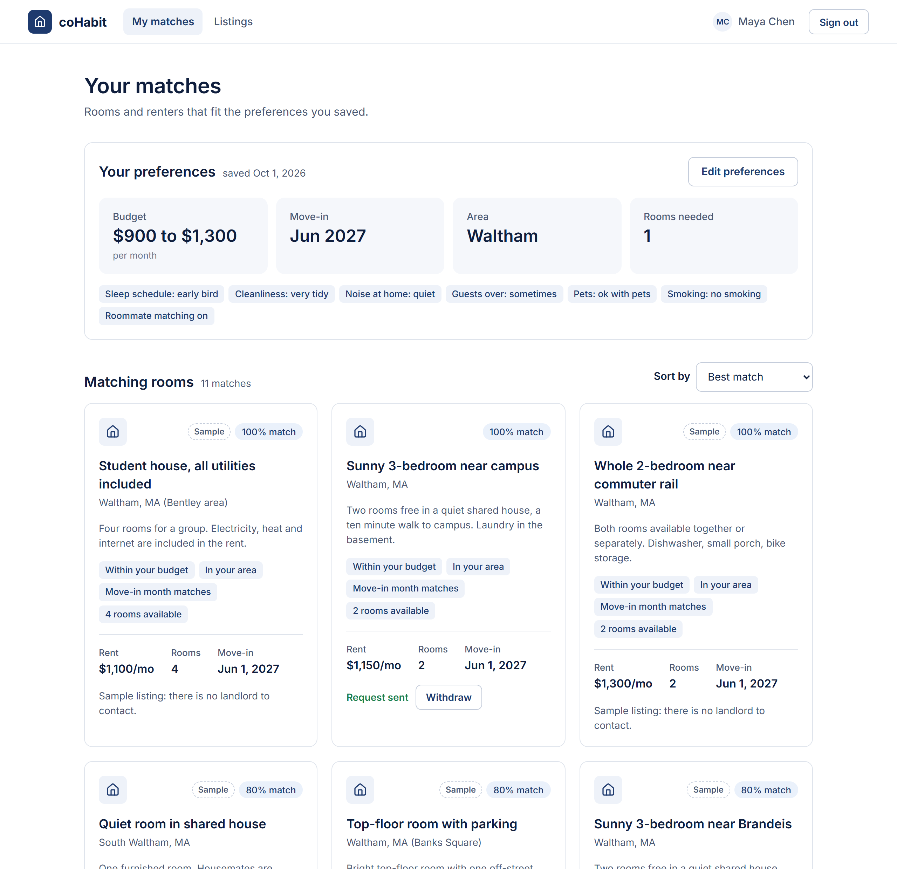
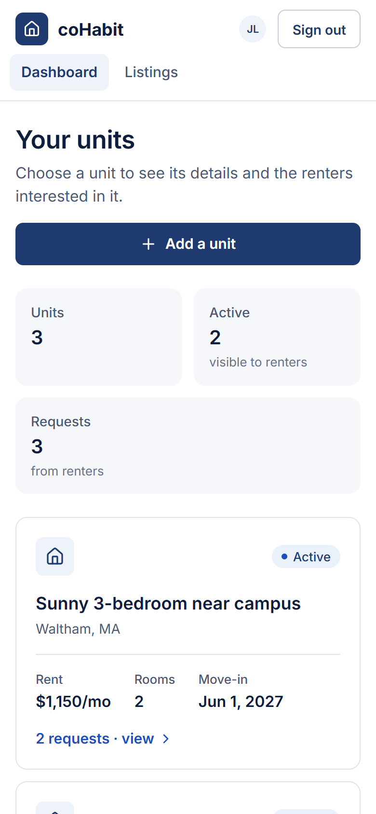
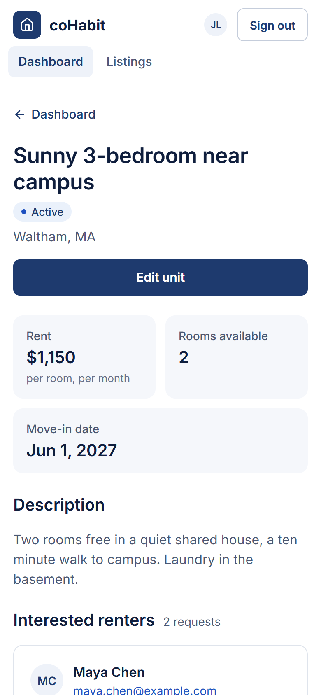

# coHabit

### [👉 Open the live site](https://cohabit-landlord-demo.dolgorsureng.workers.dev)

[](https://cohabit-landlord-demo.dolgorsureng.workers.dev)

**Landlord dashboard:** summary tiles, one card per unit, and the latest requests from renters.



**Unit page:** the unit's details and the renters interested in it, each with their note and a reply button.



**Renter's matches:** rooms ranked against the renter's questionnaire, with the reasons for each match and an "I'm interested" button.



<p align="center">
  
  &nbsp;&nbsp;
  
  <br />
  <em>The same pieces on a phone, stacked in one column.</em>
</p>

Screenshots were taken on a local copy with made-up accounts. All names, emails and listings shown are fictional.

Landlords list rooms; renters answer a short questionnaire and see rooms that fit. Sign-in is with Google. Data is stored in Cloudflare D1.

- **Live site:** https://cohabit-landlord-demo.dolgorsureng.workers.dev
- **Design (Figma):** https://www.figma.com/design/QDAewcvq3aSsZgfQvw1v4X
- **Accounts, data, secrets, deploy, rollback:** [ACCOUNTS_SETUP.md](ACCOUNTS_SETUP.md) · progress: [ACCOUNTS_WORKPLAN.md](ACCOUNTS_WORKPLAN.md)

| Page | Address | Who |
| --- | --- | --- |
| Front page | `/` | Anyone |
| Privacy policy, Terms of use | `/privacy`, `/terms` | Anyone |
| Current listings (active units) | `/listings` | Anyone |
| Sample dashboard (fictional data) | `/sample`, `/properties/<id>` | Anyone |
| Choose landlord or renter (once) | `/welcome` | Signed in |
| Your account, delete my account | `/account` | Signed in |
| Dashboard: your units and recent requests | `/landlord` | Landlords |
| One unit: details and its interested renters | `/landlord/units/<id>` | Landlords |
| Add or edit a unit | `/landlord/units/new`, `/landlord/units/<id>/edit` | Landlords |
| Questionnaire, matching rooms, "I'm interested", possible roommates (opt-in) | `/renter` | Renters |
| User list (read only) | `/admin` | Admin |

This is separate from the other coHabit app in `Documents\cohabit`. It runs on Cloudflare's free plan as its own Worker (`cohabit-landlord-demo`) with its own database (`cohabit-db`).

## Change the sample properties and tenants

1. Open `public/data.js` in any text editor (Notepad or VS Code both work).
2. Edit the text between the quote marks. The notes at the top of the file explain each field:
   - `status` must be exactly `"All clear"` or `"Lease ending soon"`.
   - `id` becomes the page address. Use lowercase letters, numbers and dashes only.
   - The tenant counts are calculated for you.
   - To add a property or tenant, copy an existing `{ ... }` block and keep the commas between blocks.
3. Save the file, then publish (below).

This only changes the fictional sample at `/sample`. Real units are added by landlords after signing in.

## Preview on your computer (optional)

Open a terminal in this folder and run (first time: see ACCOUNTS_SETUP.md for `.dev.vars` and the local database):

```
npm run db:migrate:local
npm run dev
```

Run the automated checks with `npm test`.

Then visit http://localhost:8787. Press `Ctrl+C` to stop.

## Publish changes

```
npx wrangler d1 migrations apply DB --remote
npm run deploy
```

The first command only does something when there is a new file in `migrations/`.

If Cloudflare asks you to log in, a browser window opens. Sign in and click **Allow**. The live site updates within about a minute.

If the page looks broken after an edit, the usual cause is a missing comma or quote mark in `data.js`. Undo the last change and try again.

## Files

```
public/index.html   page frame (top bar, icons)
public/app.js       the screens and navigation (calls /api/*)
public/data.js      fictional sample properties for /sample  ← edit this one
public/styles.css   colors, spacing, phone layout (values match Figma)
src/index.js        Worker: the /api/* routes and permission checks
src/auth.js         Google sign-in settings (Better Auth)
src/validate.js     checks every field sent by the browser
src/match.js        renter-to-unit matching rules
src/roommates.js    renter-to-renter (roommate) matching rules, opt-in
migrations/         database tables (D1)
tests/run-local.mjs automated local tests (npm test)
scripts/sample-data.mjs  fictional sample landlords, units and renters (see ACCOUNTS_SETUP.md)
docs/SAMPLE_MATCHING.md  how matching works, shown with the sample data
wrangler.jsonc      Cloudflare settings
```
